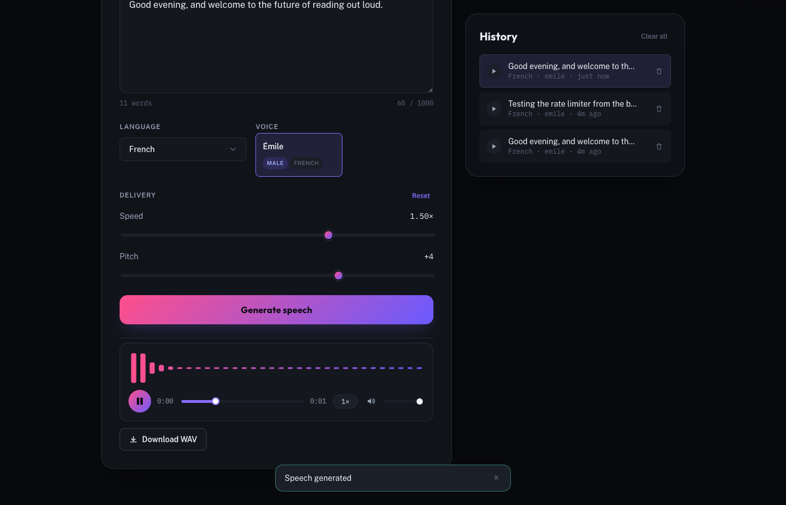
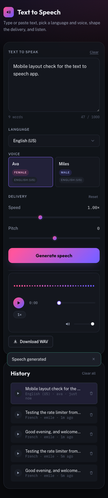
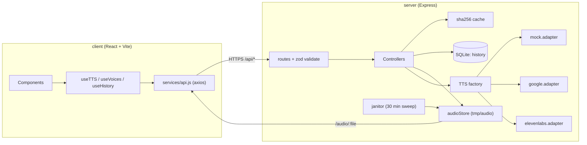

# Text to Speech

Type or paste text, pick a language and voice, shape the delivery with speed and
pitch, generate speech, play it in a custom audio player, and download it. Runs
completely offline out of the box — no API keys, no signup — and upgrades to a real
cloud TTS provider by changing one environment variable.

|                             |                            |
| --------------------------- | -------------------------- |
|  |  |

## What it is

A full-stack demo TTS product: a React/Vite client with a custom audio player and
waveform, and a Node/Express API that validates every request, caches identical
requests, keeps a history of past generations, and synthesizes speech through a
swappable provider — an offline mock by default, or Google Cloud TTS / ElevenLabs
once you add a key.

## Prerequisites

- Node.js 20+ and npm 10+
- Nothing else. The default (`mock`) provider needs no account, no key, and no
  network access.

## Install

```bash
git clone <this-repo>
cd text-to-speech
cp .env.example .env          # defaults already work — nothing to fill in
npm run install:all           # installs server/ and client/ dependencies
npm run seed                  # optional: adds a few demo entries to History
```

## Environment variables

All variables live in one `.env` file at the project root — the client reads it
too (see `client/vite.config.js`, which points Vite's env loader at the root
instead of `client/`). Every variable is documented in `.env.example`.

| Variable                   | Default                       | Meaning                                                             |
| --------------------------- | ------------------------------ | -------------------------------------------------------------------- |
| `NODE_ENV`                  | `development`                  | `development` \| `production`                                       |
| `PORT`                      | `5050`                          | Port the Express server listens on (5000 is avoided — macOS AirPlay Receiver squats on it) |
| `CLIENT_ORIGIN`             | `http://localhost:5173`        | Origin allowed to call the API (CORS)                                |
| `VITE_API_URL`              | `http://localhost:5050/api`    | Base URL the client calls                                            |
| `TTS_PROVIDER`              | `mock`                          | `mock` \| `google` \| `elevenlabs`                                   |
| `GOOGLE_TTS_API_KEY`        | *(empty)*                       | Required only when `TTS_PROVIDER=google`                             |
| `ELEVENLABS_API_KEY`        | *(empty)*                       | Required only when `TTS_PROVIDER=elevenlabs`                         |
| `ELEVENLABS_MODEL_ID`       | `eleven_multilingual_v2`        | ElevenLabs model override                                            |
| `DB_PATH`                   | `./db/history.sqlite`           | SQLite file, relative to `server/`                                   |
| `AUDIO_DIR`                 | `./tmp/audio`                   | Generated-audio directory, relative to `server/`                     |
| `AUDIO_TTL_MINUTES`         | `30`                             | Age at which the janitor deletes a generated file                    |
| `JANITOR_INTERVAL_MINUTES`  | `5`                              | How often the janitor sweep runs                                     |
| `HISTORY_LIMIT`             | `100`                            | Most-recent history rows kept; older rows are pruned                 |
| `MAX_TEXT_LENGTH`           | `1000`                           | Max characters accepted per request                                  |
| `RATE_LIMIT_WINDOW_MS`      | `60000`                          | Rate-limit window for `POST /api/tts`                                |
| `RATE_LIMIT_MAX`            | `10`                             | Max requests per IP per window                                       |

## Running the app

```bash
npm run dev
```

One command, run from the project root, boots both apps together (via
`concurrently`): the API on `http://localhost:5050` and the client on
`http://localhost:5173`. Open the client URL — the server has no UI of its own.

Run them separately if you ever need to:

```bash
npm run dev --prefix server
npm run dev --prefix client
```

## Swapping the TTS provider

Every adapter (`server/services/tts/*.adapter.js`) implements the same two
functions — `synthesize(...)` and `listVoices()` — selected by one factory
(`server/services/tts/index.js`) keyed off `TTS_PROVIDER`. To switch:

1. Set `TTS_PROVIDER=google` (or `elevenlabs`) in `.env`.
2. Add the matching API key (`GOOGLE_TTS_API_KEY` or `ELEVENLABS_API_KEY`).
3. Restart the server.

Nothing else changes — the client, the routes, validation, caching, and history
are all provider-agnostic. A 4th provider means writing one new adapter file plus
one line in the factory; nothing outside those two files needs to change. If the
active provider throws (bad key, outage), the server never falls back to the mock
silently — it logs the failure and returns a clean `503 PROVIDER_UNAVAILABLE` (or
`401 PROVIDER_AUTH_FAILED` for a rejected key).

## API reference

Base URL: `{VITE_API_URL}`, e.g. `http://localhost:5050/api`.

### `GET /api/health`

```json
{ "status": "ok", "provider": "mock", "uptimeSeconds": 42, "version": "0.1.0" }
```

### `GET /api/voices?language=en-US`

`language` is optional — omit it to get the full catalog.

```json
{ "voices": [{ "id": "ava", "name": "Ava", "language": "en-US", "gender": "female" }] }
```

### `POST /api/tts`

```json
{
  "text": "Hello there.",
  "language": "en-US",
  "voice": "ava",
  "rate": 1.0,
  "pitch": 0,
  "format": "mp3"
}
```

`rate` 0.5–2.0 (default 1.0) · `pitch` -10–10 (default 0) · `format` `mp3`\|`wav`
(default `mp3`; the mock provider always returns a real WAV regardless of this
value, since encoding a real speech-like tone to mp3 would need a codec dependency
outside this project's stack — the audio extension in the response always matches
what was actually written).

```json
{
  "success": true,
  "audioUrl": "/audio/9c2c...-....wav",
  "durationMs": 1485,
  "cached": false,
  "expiresAt": "2026-09-13T20:14:52.731Z"
}
```

### `GET /api/history?limit=20`

```json
{
  "items": [
    {
      "id": "a627...",
      "textPreview": "Hello there.",
      "language": "en-US",
      "voice": "ava",
      "audioUrl": "/audio/9c2c....wav",
      "createdAt": "2026-09-13T20:14:52.731Z"
    }
  ]
}
```

### `DELETE /api/history/:id` → `204` · `DELETE /api/history` → `204` (clear all)

### Errors

Every error, everywhere in the API, takes this shape:

```json
{ "success": false, "error": { "code": "EMPTY_TEXT", "message": "Text is required.", "field": "text" } }
```

| Code                     | Status | When                                                    |
| ------------------------ | ------ | -------------------------------------------------------- |
| `EMPTY_TEXT`              | 400    | Text is missing or blank after trimming                  |
| `TEXT_TOO_LONG`           | 400    | Text exceeds `MAX_TEXT_LENGTH`                            |
| `UNSUPPORTED_LANGUAGE`    | 400    | Language isn't one of the 9 supported locales             |
| `INVALID_VOICE`           | 400    | Voice id doesn't exist for the active provider             |
| `VOICE_LANGUAGE_MISMATCH` | 400    | Voice exists, but not for the submitted language           |
| `INVALID_RATE`            | 400    | Rate outside 0.5–2.0                                       |
| `INVALID_PITCH`           | 400    | Pitch outside -10–10                                       |
| `RATE_LIMITED`            | 429    | More than `RATE_LIMIT_MAX` requests/IP in the window (body includes `retryAfter`, seconds) |
| `PROVIDER_AUTH_FAILED`    | 401    | Active provider rejected the key, or none is configured    |
| `PROVIDER_UNAVAILABLE`    | 503    | Active provider is unreachable or erroring                 |
| `NOT_FOUND`               | 404    | Unmatched route, or deleting a history id that doesn't exist |
| `INTERNAL`                | 500    | Anything unexpected (never leaks a stack trace or provider detail) |

The full request/response set, including every error case above, is in
[`postman_collection.json`](postman_collection.json).

## Architecture



## Deployment

**Client → Vercel.** Root directory `client/`, build command `npm run build`,
output `dist`. Set `VITE_API_URL` in the Vercel project's environment variables to
your deployed server's `/api` URL.

**Server → Render.** Root directory `server/`, build command `npm install`, start
command `npm start`. Set `CLIENT_ORIGIN` to your deployed Vercel URL, and add
`TTS_PROVIDER` + the matching key if you're using a real provider. Render's disk
is ephemeral on most plans — that's fine for `tmp/audio` (files are meant to be
short-lived anyway) but mount a persistent disk at `DB_PATH`'s directory if you
want history to survive a redeploy.

## Troubleshooting

- **"Address already in use" on port 5000/7000** — macOS Control
  Center/AirPlay Receiver owns those by default; this project defaults to 5050
  for exactly that reason. If you changed `PORT` back, change it again.
- **CORS error in the browser console** — `CLIENT_ORIGIN` in `.env` must exactly
  match the origin the client is actually served from (protocol + host + port).
- **Generate button stays disabled** — text must be non-empty (after trimming)
  and a voice must be selected; the button also disables while a request is in
  flight.
- **429 "Too many requests"** — the app deliberately caps `POST /api/tts` at
  `RATE_LIMIT_MAX` per `RATE_LIMIT_WINDOW_MS` per IP. Wait for the window to
  reset, or raise the limit in `.env` for local development.
- **Switched `TTS_PROVIDER` and everything 401s** — you set the provider but not
  its key. Add `GOOGLE_TTS_API_KEY` or `ELEVENLABS_API_KEY` and restart the server.
- **History is empty after `npm run seed`** — the seed script writes to
  `DB_PATH`; if you changed that between seeding and running the app, they're
  pointing at two different SQLite files.

## Known limitations & next steps

- The mock provider always returns WAV (a real, distinctly-toned playable clip
  per voice) regardless of the requested `format` — encoding to mp3 would need a
  codec dependency outside this project's fixed stack. Both real adapters honor
  `format` properly.
- ElevenLabs has no native pitch control, so `pitch` is a no-op under that
  provider; `rate` maps to its `speed` voice setting instead.
- ElevenLabs voices don't reliably self-report a language; ones without a label
  default to `en-US` in `GET /api/voices`.
- History's `textPreview` is truncated at 80 characters (the API contract's
  chosen shape) — replaying a long entry repopulates the text box with that
  preview, not the original full text.
- `PROVIDER_UNAVAILABLE` was verified by stubbing a network failure rather than
  against the real Google/ElevenLabs endpoints (this dev sandbox has no outbound
  internet access) — worth a real smoke test against live keys before shipping.
- The synthesis cache is in-memory and per-process; it resets on server restart
  (by design — it's scoped to the same 30-minute lifetime as the audio files it
  points to).

To point this at a real provider today: set `TTS_PROVIDER=google` or
`elevenlabs`, add the key, restart the server, and pick a voice from that
provider's now-live `GET /api/voices` response — no other change required.
